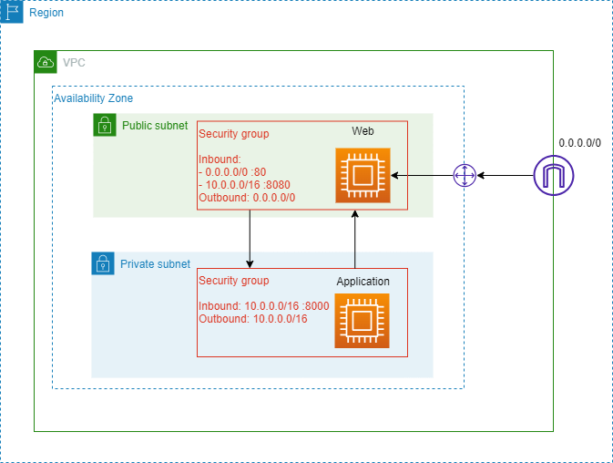

# Simple calculator

## Abstraction

1. User shall input basic math (addition, subtraction, multiply, division) on the web
2. Web shall send the HTTP request to application
3. Application shall perform the calculation and then send the request back to web.

## System Design

1. Create VPC in only one AZ with two different subnets. One for public and other for private subnets.

2. The front end EC2 will host on public subnet and the backend EC2 will host application on private subnet.

3. The frontend will received the HTTP request from the internet and send back to user through default HTTP port 80.

4. Any application request shall from the user will go through the 

